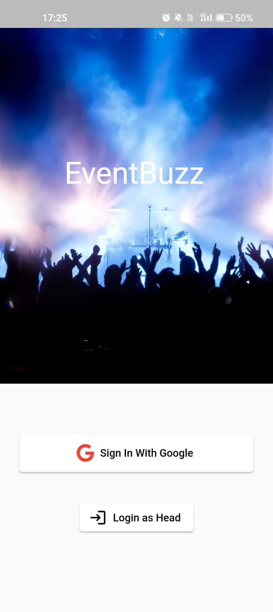
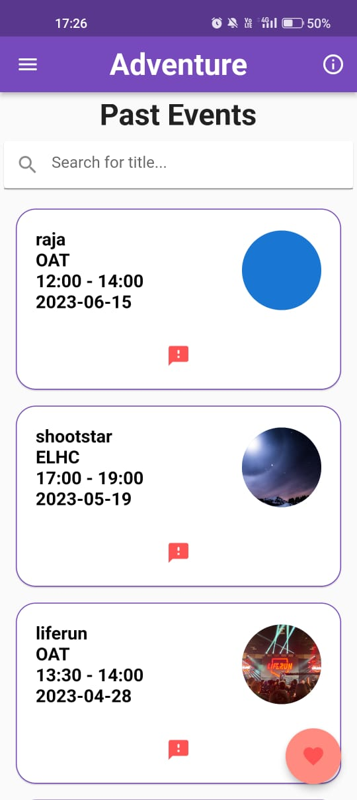
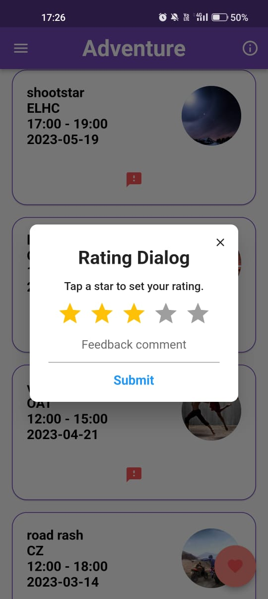
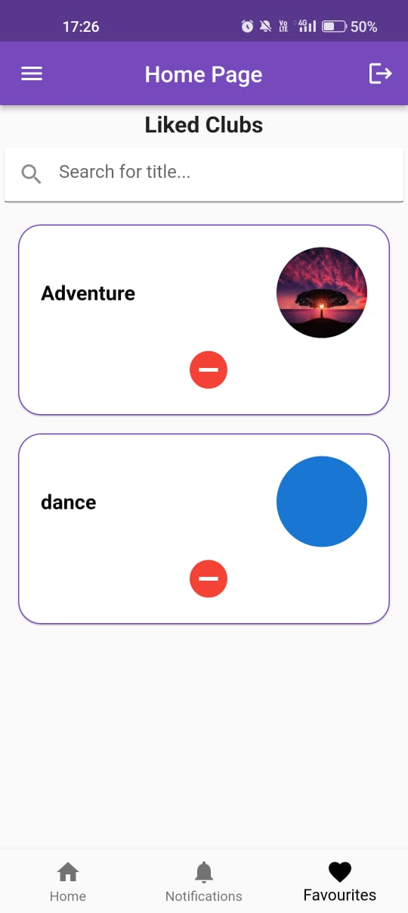
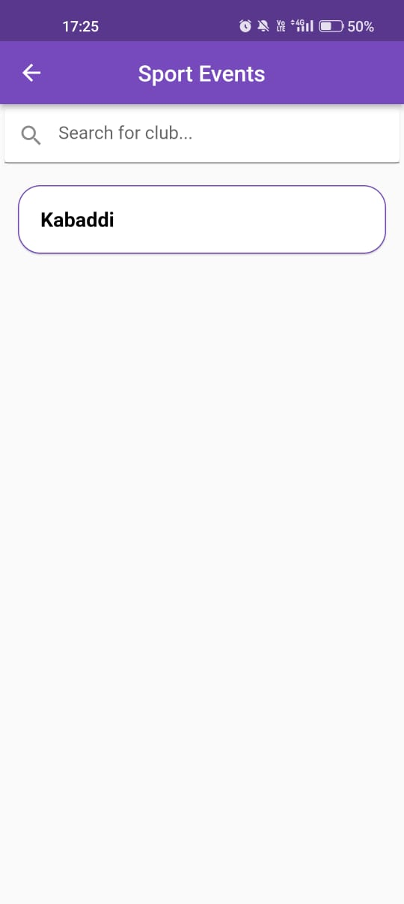
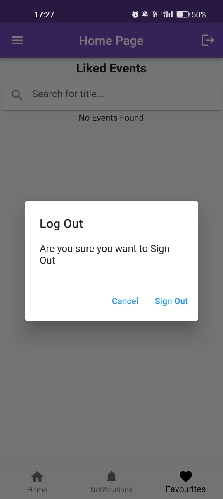
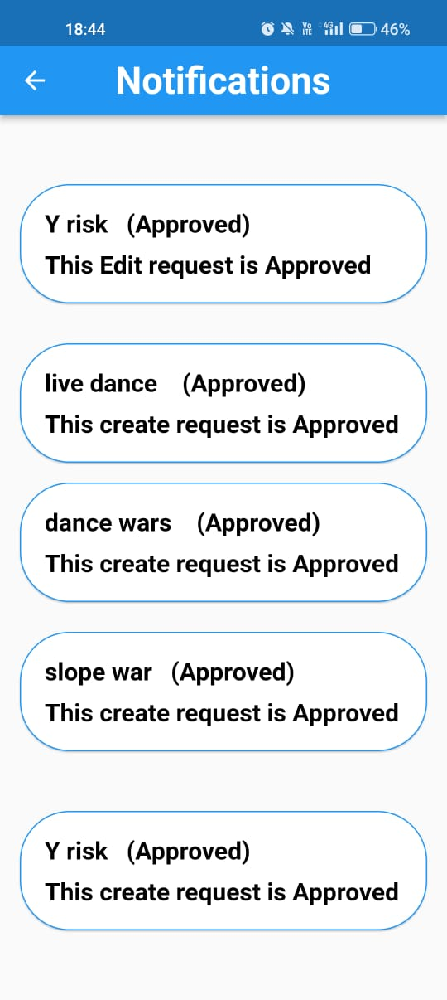
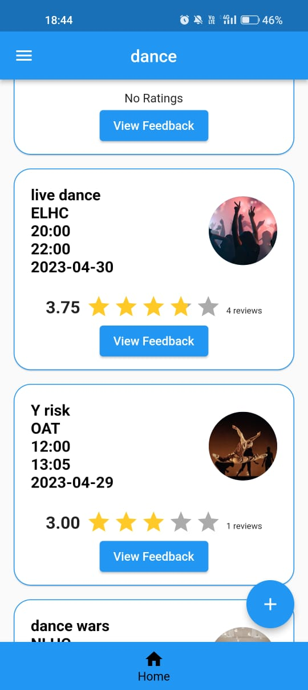
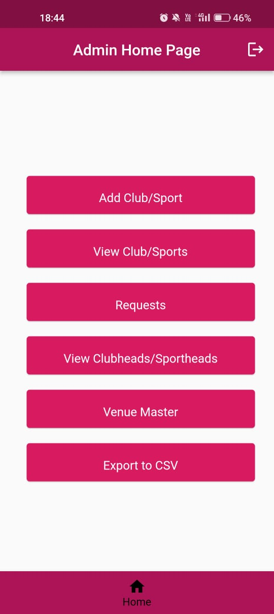

# EventBuzz App

## Table of Contents

- [Project Overview](#project-overview)
- [Installation](#installation)
- [Features](#features)
- [Screenshots](#screenshots)

## Project Overview

The Event Management app is a comprehensive platform that offers students access to a wide array of organization events with detailed information. Alongside event exploration, students can actively engage by providing valuable feedback for each event and exploring club and sport-wise event listings. The app's dual login system facilitates efficient event management, granting club heads the ability to create, edit, and review event posts, including feedback, while the admin oversees the approval process, ensuring a structured hierarchy. Through seamless collaboration among students, department heads, and administrators, the app aims to streamline event coordination. Moreover, students can conveniently favorite clubs and sports for easy access, and notifications are generated for all events and liked events, enhancing user engagement and communication.

## Installation

1. Download the zip folder.
2. Extract the folder.
3. Open this in your favourite IDE
4. Run the application.

## Features

* Event Discovery: Effortlessly find and stay informed about all organization events, ensuring students never miss out on exciting opportunities.
* Department-Wise Listings: Explore events conveniently categorized by departments, making it simple to discover events aligned with specific interests.
* Hierarchy Management: A well-defined hierarchy ensures efficient event coordination, fostering seamless collaboration among organizers and administrators.
* Feedback Collection: Students can actively engage by providing valuable feedback for each event, promoting continuous improvement and enhancing future event planning.
* Clear Event Details: Access comprehensive event information, including department affiliations and timing details, for a well-informed event selection process.
* Event Search: Easily search events by venue and name, facilitating quick access to relevant event information.
* Notifications: Stay updated with real-time notifications for all events and liked events, ensuring timely awareness of event announcements and changes.
* Liked Events: Customize event recommendations by liking favorite events and clubs, creating a personalized event experience tailored to individual preferences.

## Screenshots

    Students View

`

     Club Heads View
     

     Admin View

